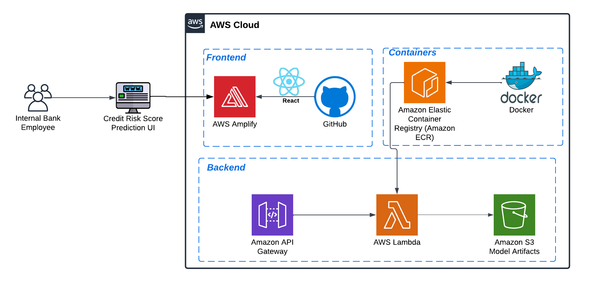

# models-credit-risk

## Architecture

# Quickstart

## [Deploy frontend in local](frontend/README.md)

For deploy in amplify, you must upload your repo into github and config aws amplify with it (the yml file for that is already include in the frontend folder)

## [Deploy Backend](backend/readme.md)

## Modelo

